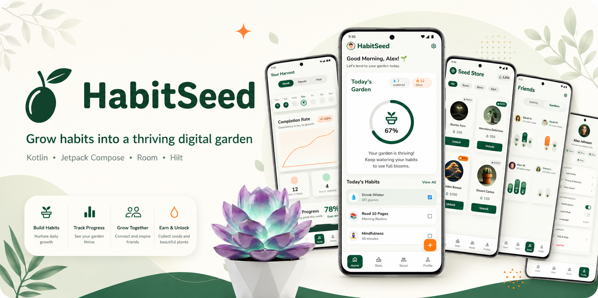
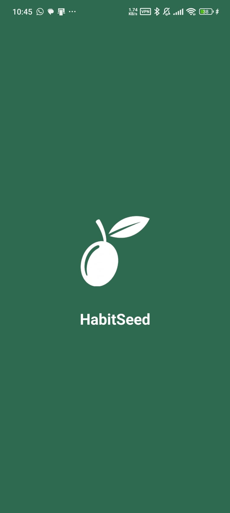
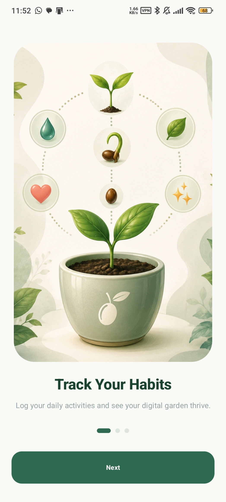
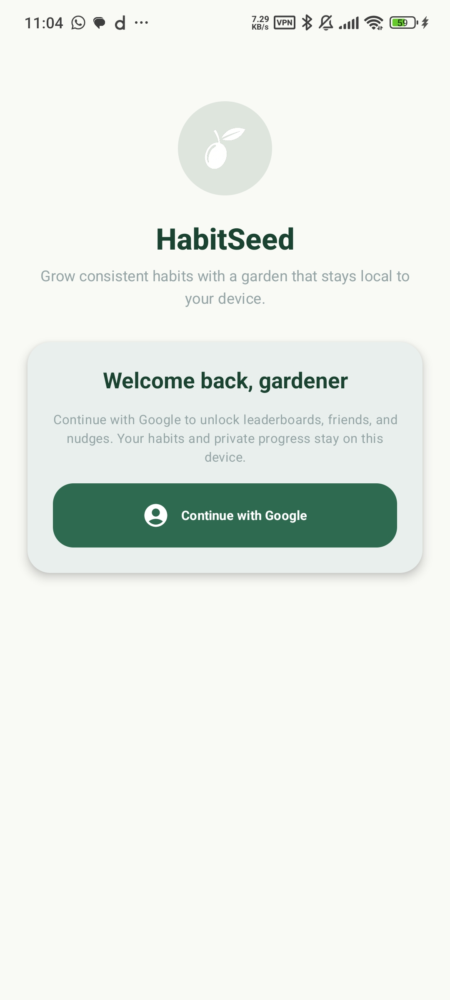
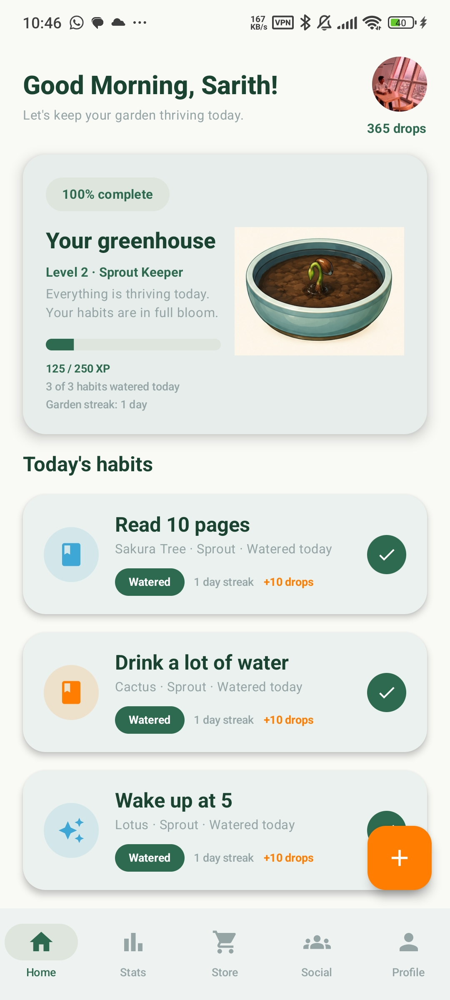
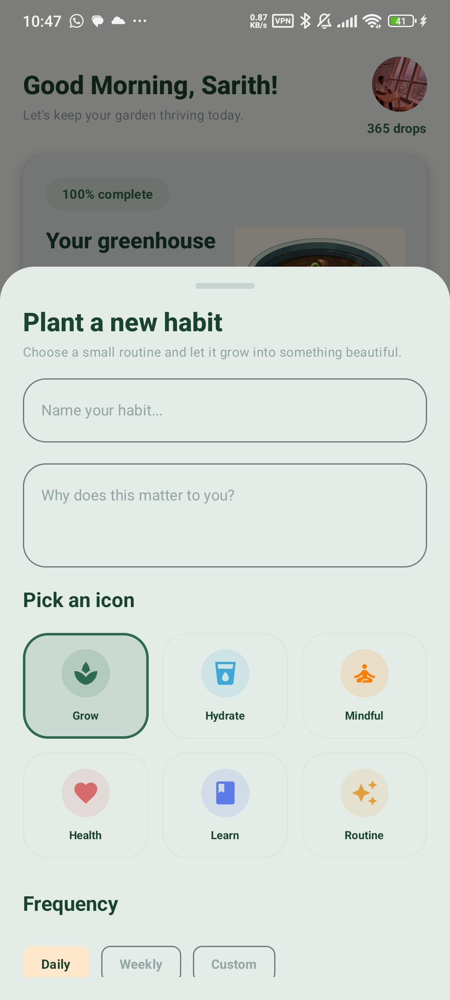
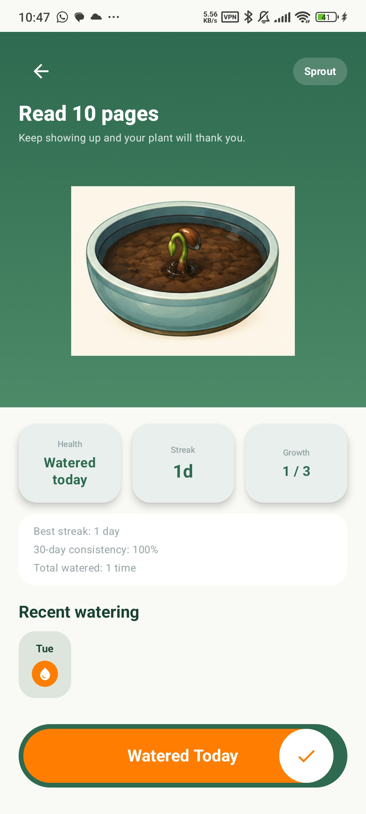
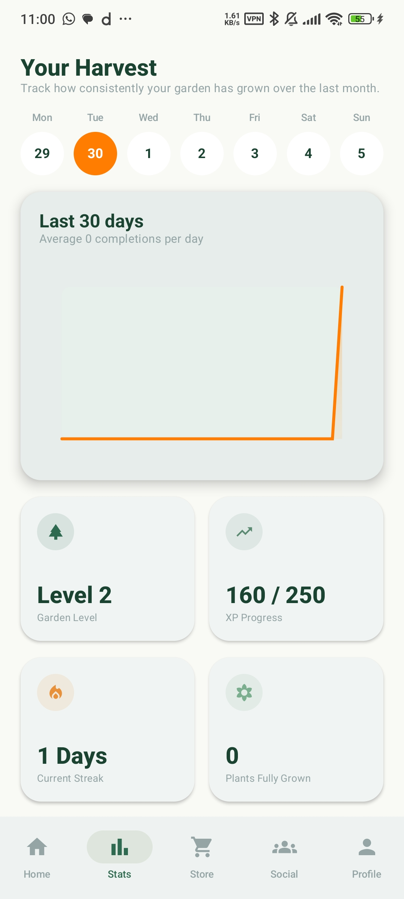
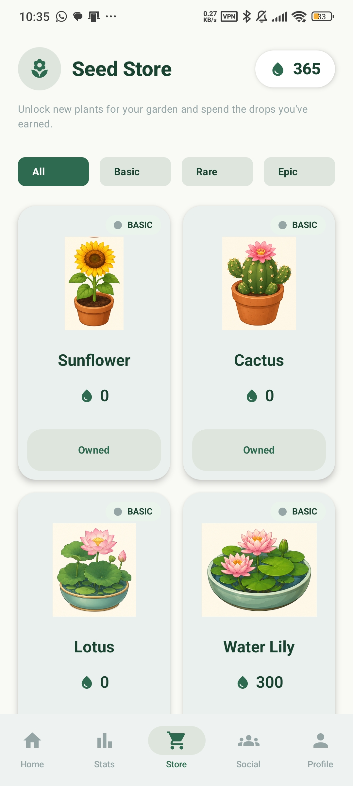
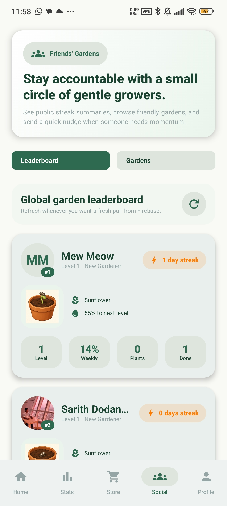

<p align="center">
  
</p>

# HabitSeed 🌱

HabitSeed is a gamified Android habit tracker that turns daily routines into a growing digital garden. Users create habits, swipe to water them, earn water drops and Garden XP, grow plants through six stages, unlock new plants, review progress, and connect with friends through Firebase-backed social gardens.

The app is built with Kotlin, Jetpack Compose, Room, Hilt, Material 3, WorkManager, Firebase Auth, and Firestore. Private habit data stays local in Room; the cloud layer only publishes a safe public garden summary for leaderboard and following features.

---

## Preview

| Splash                                    | Onboarding                                        | Login                                   |
| ----------------------------------------- | ------------------------------------------------- | --------------------------------------- |
|  |  |  |

| Home                                  | Add Habit                                       | Habit Detail                                          |
| ------------------------------------- | ----------------------------------------------- | ----------------------------------------------------- |
|  |  |  |

| Statistics                                   | Seed Store                                   | Social                                    |
| -------------------------------------------- | -------------------------------------------- | ----------------------------------------- |
|  |  |  |


---

## Current App

HabitSeed now includes the full Compose app flow:

* Splash, onboarding, Firebase/Google login, and logout
* Home greenhouse with daily habits, streaks, Garden XP, and plant status
* Add Habit flow with plant selection, frequency settings, and optional reminders
* Habit detail screen with swipe-to-water completion, plant growth, and health feedback
* Statistics screen using real Room completion logs
* Seed Store with unlockable plant catalog and local purchase persistence
* Social gardens with Firestore leaderboard, following, friend search by UID, and nudges
* Profile and edit-profile screens with avatar URL, settings, and public profile sync
* Notification reminders, plant health alerts, reward notifications, social nudge alerts, and haptics

---

## Habit Loop

1. Create a habit and assign it a plant.
2. Complete the habit once per day by watering it.
3. Earn water drops and Garden XP.
4. Build streaks, progress plant stages, and trigger milestone rewards.
5. Spend water drops in the Seed Store to unlock more plants.
6. Sync a privacy-safe garden summary to Firebase for social features.

Reward rules are centralized in `RewardCalculator`: normal completion gives 10 drops and 10 XP, stage-ups give extra rewards, fully grown plants grant a larger bonus, and perfect days grant an additional daily reward.

---

## Gamification

Plants grow through these stages: Seed, Sprout, Young Plant, Healthy Plant, Blooming Plant, and Fully Grown. The app ships stage-aware WebP assets for sunflower, cactus, lotus, water lily, bonsai, lavender, mushroom garden, venus flytrap, and sakura tree.

Garden XP powers account-level progression from New Gardener through Habit Sage. Plant health uses completion history to show Fresh, Healthy, Dry, Wilting, or Dormant states without deleting or killing plants.

---

## Data And Privacy

HabitSeed is local-first for personal data. Room stores users, settings, habits, logs, plant types, purchases, unlocked plants, social caches, and local mock friend data.

Firebase is used for:

* Google sign-in
* Public garden summaries
* Leaderboards
* Following snapshots
* Social nudges

Firebase public profiles do not include private habit titles, descriptions, notes, emails, water-drop balances, exact Garden XP, or individual habit logs.

---

## Tech Stack

* **Language:** Kotlin
* **UI:** Jetpack Compose, Material 3
* **Architecture:** MVVM-style ViewModels, repositories, Hilt dependency injection
* **Local data:** Room database, migrations, seed data, Kotlin Flows
* **Background work:** WorkManager for daily and habit-specific reminders
* **Cloud/social:** Firebase Auth, Firestore, Google Sign-In through Credential Manager
* **Media:** Coil for remote profile images
* **Testing:** JUnit unit tests for repositories, date/streak logic, gamification, social mapping, and plant assets

---

## Project Structure

```text
app/src/main/java/com/habitseed/app/
  data/
    auth/          Firebase and Google sign-in adapters
    local/         Room database, DAOs, entities, cache tables
    repository/    Habit, user, shop, and local social repositories
    social/        Firestore social sync and DTOs
  domain/
    gamification/  Growth, health, level, and reward calculators
    repository/    Repository contracts and result models
    social/        Public profile privacy and mapping rules
    util/          Date, streak, and progress helpers
  notifications/   Notification channels, notifier, scheduler, worker
  ui/
    components/    Shared Compose components and plant rendering
    feedback/      Haptics and notification permission helpers
    navigation/    App routes, bottom navigation, NavHost
    screens/       Splash, onboarding, login, home, habit detail, stats, store, social, profile
    theme/         HabitSeed Material theme tokens

docs/
  brand/           GitHub banner
  screenshots/     README screenshots
```

---

## Setup

Recommended environment:

* Android Studio
* JDK 17
* Android SDK API 34
* Emulator or Android device running API 26+

Firebase is configured through `app/google-services.json` in this checkout. If you use a different Firebase project, replace that file with your own Android app config and publish/update `firestore.rules` for the Firestore social collections.

---

## Build And Test

From the project root:

```bash
./gradlew assembleDebug
./gradlew testDebugUnitTest
```

On Windows PowerShell:

```powershell
.\gradlew assembleDebug
.\gradlew testDebugUnitTest
```

---

## Status

HabitSeed is an implemented Android app with local habit tracking, gamified plant progression, store unlocks, statistics, profile settings, notifications, haptics, and Firebase-backed social garden features.

---

## License

This project is for academic and portfolio use.
