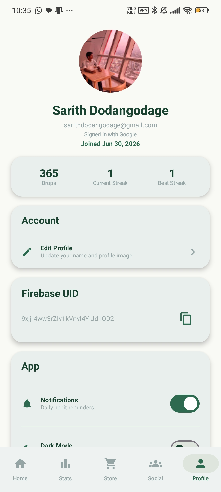

# HabitSeed 🌱

HabitSeed is a gamified Android habit-tracking app that turns daily routines into a growing digital garden. Users create habits, complete them daily, earn water drops, grow plants, unlock rewards, view statistics, interact with mock friends, and manage their profile settings.

The project is built as a local-first Android application using Kotlin, Jetpack Compose, Room, Hilt, Material 3, and Navigation Compose.

---

## Preview

| Splash                                    | Onboarding                                        | Login                                   |
| ----------------------------------------- | ------------------------------------------------- | --------------------------------------- |
|  |  |  |

| Home                                  | Add Habit                                       | Habit Detail                                          |
| ------------------------------------- | ----------------------------------------------- | ----------------------------------------------------- |
|  |  |  |

| Statistics                                   | Seed Store                                   | Social                                    |
| -------------------------------------------- | -------------------------------------------- | ----------------------------------------- |
|  |  |  |

| Profile                                     |
| ------------------------------------------- |
|  |

---

## Features

* Splash screen with HabitSeed branding
* Onboarding flow
* Local demo login/sign-up flow
* Home dashboard with daily habit progress
* Add Habit modal bottom sheet
* Habit detail screen with swipe-to-water interaction
* One-completion-per-day habit protection
* Water drop reward system
* Plant growth system
* Streak and completion tracking
* Statistics dashboard with progress overview
* Seed Store with unlockable plants/rewards
* Local purchase and ownership persistence
* Social/Friends Gardens screen with mock accountability features
* Profile and settings screen
* Persistent local data using Room
* Bottom navigation across main app screens
* Jetpack Compose UI with Material 3 styling
* Hilt dependency injection
* Navigation Compose routing

---

## Tech Stack

* **Language:** Kotlin
* **UI:** Jetpack Compose
* **Design:** Material 3
* **Architecture:** MVVM-style separation
* **Database:** Room
* **Dependency Injection:** Hilt
* **Navigation:** Navigation Compose
* **Data:** Local-first demo data

---

## App Concept

HabitSeed transforms habit tracking into a calming plant-growth experience.

Instead of only checking off tasks, users grow a digital garden by completing habits consistently. Each habit is connected to plant progress, streaks, and water-drop rewards. The goal is to make habit tracking feel visual, gentle, and motivating.

---

## Main Screens

* **Splash Screen** — HabitSeed branding
* **Onboarding** — App introduction and value proposition
* **Login / Sign Up** — Local demo authentication
* **Home Dashboard** — Daily habits, garden progress, and habit list
* **Add Habit Modal** — Create new habits quickly from a bottom sheet
* **Habit Detail** — Swipe to water habits and view progress
* **Statistics** — Completion trends, streaks, and growth summary
* **Seed Store** — Unlock plants and rewards using water drops
* **Social Gardens** — Mock friends, leaderboards, and nudge actions
* **Profile Settings** — User profile, preferences, and logout flow

---

## Project Structure

```text
app/
  src/main/
    java/com/habitseed/app/
      data/
      domain/
      ui/
      di/
    res/
docs/
  screenshots/
  brand/
```

---

## How to Run

1. Clone the repository.

```bash
git clone https://github.com/xari-ya/HabitSeed.git
```

2. Open the project in Android Studio.

3. Let Gradle sync finish.

4. Select the `app` run configuration.

5. Run the app on an emulator or Android device.

Recommended setup:

* Android Studio
* JDK 17
* Android SDK API 34 or newer
* Emulator/device with API 26+

---

## Build Commands

From the project root:

```bash
./gradlew clean assembleDebug
./gradlew testDebugUnitTest
```

On Windows PowerShell:

```powershell
.\gradlew clean assembleDebug
.\gradlew testDebugUnitTest
```

---

## Status

HabitSeed is fully implemented as a local-first Android demo application. The app includes the complete main flow from splash and onboarding to habit tracking, watering, statistics, rewards, social gardens, and profile settings.

---

## Author

Developed by **xari-ya** as a mobile application development project.

---

## License

This project is for academic and portfolio use.
